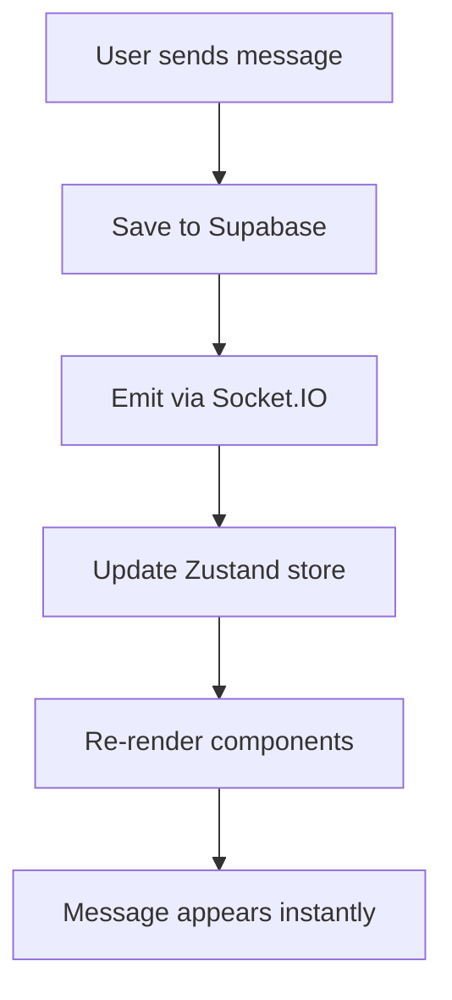

<div align="center">

# 🟢 WhatsCopy - Real-time Chat App

<p align="center">
  <strong>A modern, full-stack real-time chat application inspired by WhatsApp</strong>
</p>

<p align="center">
  
  
  
  
  
</p>

<p align="center">
  <a href="#-features">Features</a> •
  <a href="#-tech-stack">Tech Stack</a> •
  <a href="#-quick-start">Quick Start</a> •
  <a href="#-folder-structure">Structure</a> •
  <a href="#-setup">Setup</a>
</p>

---

</div>

## ✨ Features

<table>
  <tr>
    <td align="center"><strong>🔐 Authentication</strong><br>Secure login & registration</td>
    <td align="center"><strong>💬 Real-time Chat</strong><br>Instant messaging with Socket.IO</td>
    <td align="center"><strong>🖼️ Media Sharing</strong><br>Image preview & upload</td>
  </tr>
  <tr>
    <td align="center"><strong>📱 Responsive Design</strong><br>Mobile-first approach</td>
    <td align="center"><strong>⚡ Fast Performance</strong><br>Optimized with Next.js 15</td>
    <td align="center"><strong>🎨 Modern UI</strong><br>Sleek WhatsApp-inspired design</td>
  </tr>
</table>

## 🚀 Tech Stack

<div align="center">

| **Category** | **Technology** | **Purpose** |
|:---:|:---:|:---:|
| **Frontend** |  | App Router & React Framework |
| **Backend** |  | Database & Authentication |
| **Real-time** |  | Live messaging |
| **Styling** |  | Utility-first CSS |
| **State** |  | State management |
| **Language** |  | Type safety |

</div>

## 🏗️ Folder Structure

<details>
<summary><strong>📂 Click to expand project structure</strong></summary>

```
📦 whatscopy/
├── 📁 app/
│   ├── 📁 (auth)/                    # 🔐 Authentication routes
│   │   ├── 📄 login/page.tsx         # Login form
│   │   └── 📄 register/page.tsx      # Registration form
│   ├── 📁 (dashboard)/               # 💬 Main chat interface
│   │   ├── 📄 page.tsx               # Dashboard home
│   │   ├── 📄 layout.tsx             # Dashboard layout
│   │   └── 📄 chat/[chatID]/page.tsx # Individual chat page
│   ├── 📄 page.tsx                   # 🏠 Landing page
│   └── 📄 layout.tsx                 # 🌐 Global layout
│
├── 📁 components/
│   ├── 📁 Chat/                      # 💬 Chat-related components
│   │   ├── 📄 ChatHeader.tsx         # Chat header with user info
│   │   ├── 📄 ChatInput.tsx          # Message input field
│   │   ├── 📄 MessageList.tsx        # Messages container
│   │   └── 📄 MessageBubble.tsx      # Individual message bubble
│   └── 📁 Sidebar/                   # 📋 Sidebar components
│       ├── 📄 ChatList.tsx           # List of all chats
│       └── 📄 UserItem.tsx           # User list item
│
├── 📁 hooks/                         # 🪝 Custom React hooks
│   ├── 📄 useDebounce.ts             # Input debouncing
│   ├── 📄 useUser.ts                 # User data fetching
│   ├── 📄 useChatScroll.ts           # Auto-scroll chat
│   └── 📄 useMediaPreview.ts         # Media preview logic
│
├── 📁 lib/                           # 🛠️ Utility libraries
│   ├── 📄 supabase.ts                # Supabase client config
│   ├── 📄 socket.ts                  # Socket.IO setup
│   └── 📄 formatDate.ts              # Date formatting utils
│
├── 📁 store/                         # 🗃️ Zustand state management
│   ├── 📄 useUserStore.ts            # User state
│   └── 📄 useChatStore.ts            # Chat state
│
├── 📁 types/                         # 📝 TypeScript definitions
│   ├── 📄 user.ts                    # User types
│   ├── 📄 message.ts                 # Message types
│   └── 📄 chat.ts                    # Chat types
│
└── 📁 middleware/                    # 🛡️ Auth middleware
    └── 📄 authMiddleware.ts          # Route protection
```

</details>

## ⚡ Quick Start

### Prerequisites

> ⚠️ **Requirements:** Node.js 18+ and npm/yarn

### 1️⃣ Clone & Install

```bash
# Clone the repository
git clone https://github.com/your-username/whatscopy.git
cd whatscopy

# Install dependencies
npm install
# or
yarn install
```

### 2️⃣ Environment Setup

Create a `.env.local` file in the root directory:

```env
# 🔐 Supabase Configuration
NEXT_PUBLIC_SUPABASE_URL=your_supabase_project_url
NEXT_PUBLIC_SUPABASE_ANON_KEY=your_supabase_anon_key

# 🔌 Socket.IO (optional - defaults to localhost:3001)
NEXT_PUBLIC_SOCKET_URL=ws://localhost:3001
```

### 3️⃣ Run Development Server

```bash
npm run dev
# or
yarn dev
```

Open [http://localhost:3000](http://localhost:3000) in your browser! 🎉

## 🔧 Supabase Setup

<details>
<summary><strong>📋 Database Schema & Configuration</strong></summary>

### Step 1: Create Supabase Project
1. Go to [Supabase](https://supabase.com) and create a new project
2. Wait for the project to be ready

### Step 2: Database Tables

Execute these SQL commands in your Supabase SQL editor:

```sql
-- Users table
CREATE TABLE users (
  id UUID DEFAULT gen_random_uuid() PRIMARY KEY,
  email VARCHAR UNIQUE NOT NULL,
  username VARCHAR UNIQUE NOT NULL,
  avatar TEXT,
  created_at TIMESTAMP DEFAULT NOW()
);

-- Chats table
CREATE TABLE chats (
  id UUID DEFAULT gen_random_uuid() PRIMARY KEY,
  members UUID[] NOT NULL,
  created_at TIMESTAMP DEFAULT NOW()
);

-- Messages table
CREATE TABLE messages (
  id UUID DEFAULT gen_random_uuid() PRIMARY KEY,
  chat_id UUID REFERENCES chats(id) ON DELETE CASCADE,
  sender_id UUID REFERENCES users(id) ON DELETE CASCADE,
  text TEXT,
  media_url TEXT,
  timestamp TIMESTAMP DEFAULT NOW()
);
```

### Step 3: Enable Realtime
1. Go to **Database** → **Replication**
2. Enable realtime for the `messages` table

### Step 4: Authentication
1. Go to **Authentication** → **Settings**
2. Enable **Email** provider
3. Configure your site URL

</details>

## 🔄 Real-time Architecture

<div align="center">



</div>

## 🧩 Key Components

<table>
  <tr>
    <th>Component</th>
    <th>Description</th>
    <th>Key Features</th>
  </tr>
  <tr>
    <td><strong>🗨️ ChatHeader</strong></td>
    <td>Displays chat partner info</td>
    <td>Avatar, name, online status</td>
  </tr>
  <tr>
    <td><strong>💭 MessageBubble</strong></td>
    <td>Individual message display</td>
    <td>Sender styling, timestamps, media</td>
  </tr>
  <tr>
    <td><strong>✍️ ChatInput</strong></td>
    <td>Message composition area</td>
    <td>Text input, media upload, send button</td>
  </tr>
  <tr>
    <td><strong>📋 ChatList</strong></td>
    <td>Sidebar chat navigation</td>
    <td>Real-time updates, last message preview</td>
  </tr>
</table>

## 🪝 Custom Hooks

| Hook | Purpose | Returns |
|------|---------|---------|
| `useUser` | Fetch user data from Supabase | User object & loading state |
| `useDebounce` | Debounce input values | Debounced value |
| `useChatScroll` | Auto-scroll chat to bottom | Scroll ref & scroll function |
| `useMediaPreview` | Handle image preview | Preview state & handlers |

## 🗺️ Route Structure

<div align="center">

| Route | Access | Description |
|:------|:------:|:------------|
| `/` | 🌐 Public | Landing page with app intro |
| `/login` | 🌐 Public | User authentication |
| `/register` | 🌐 Public | New user registration |
| `/dashboard` | 🔐 Protected | Main chat interface |
| `/dashboard/chat/[id]` | 🔐 Protected | Individual chat view |

</div>

## 🔮 Roadmap

<div align="center">

### 🚧 Coming Soon

| Feature | Status | Priority |
|:--------|:------:|:--------:|
| 👥 Group Chats | Planning | High |
| ✅ Read Receipts | Development | Medium |
| 🟢 Online Status | Planning | Medium |
| 🎵 Voice Notes | Research | Low |
| 📱 PWA Support | Planning | High |

</div>

## 🤝 Contributing

We welcome contributions! Please see our [Contributing Guide](CONTRIBUTING.md) for details.

<div align="center">

### 💡 Ideas for Contributors

- 🐛 Bug fixes and improvements
- 🎨 UI/UX enhancements  
- 📚 Documentation updates
- ✨ New feature implementations

</div>

## 📄 License

This project is licensed under the MIT License - see the [LICENSE](LICENSE) file for details.

## 🙏 Acknowledgments

- Inspired by WhatsApp's clean design
- Built with amazing open-source tools
- Special thanks to the Next.js and Supabase communities

---

<div align="center">

**Built with ❤️ by [Your Name]**

⭐ Star this repo if you found it helpful!

</div>
